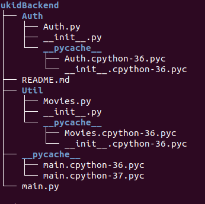
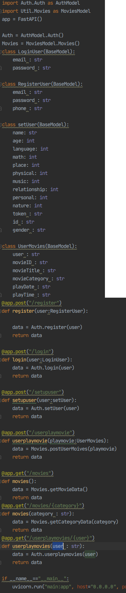
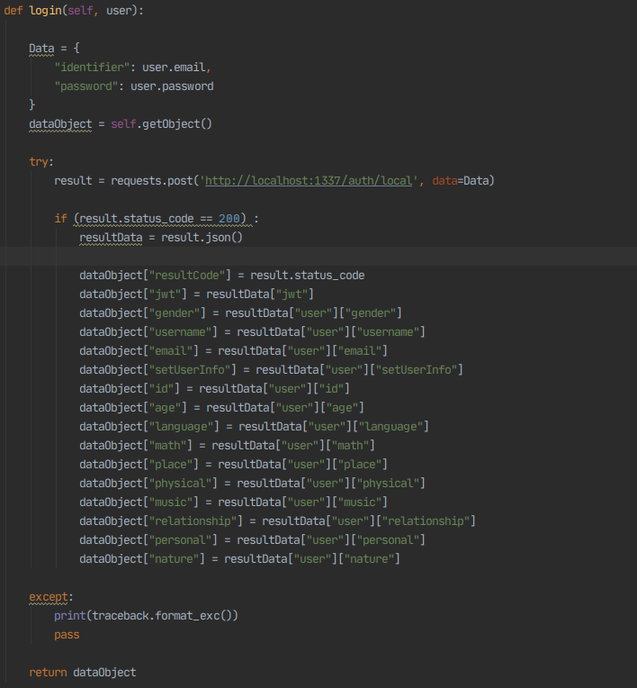
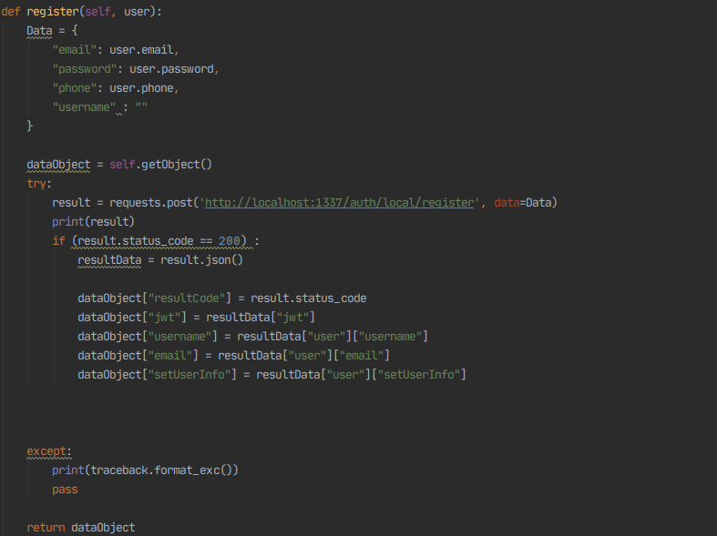
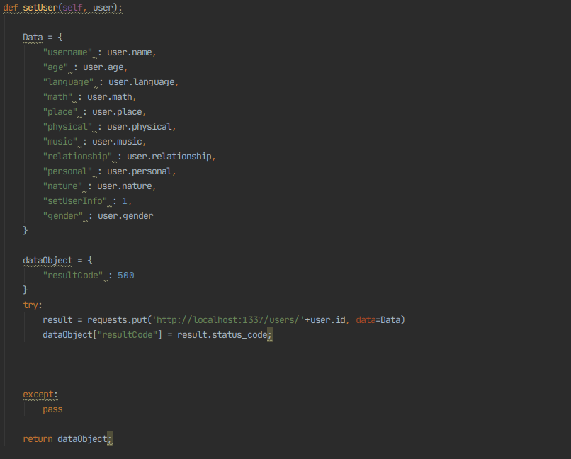
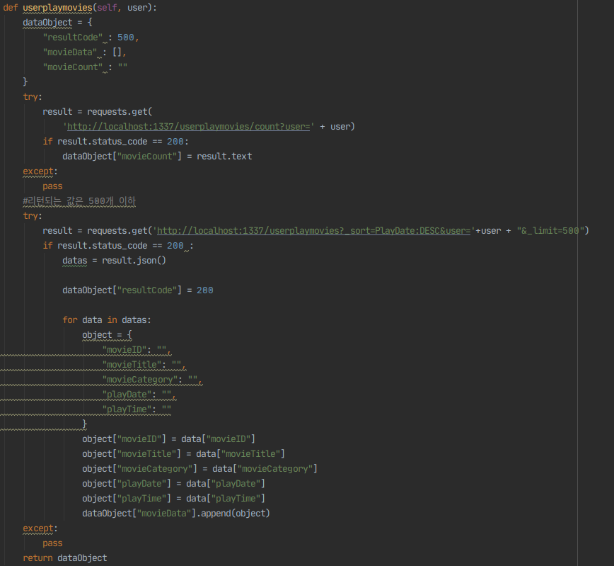
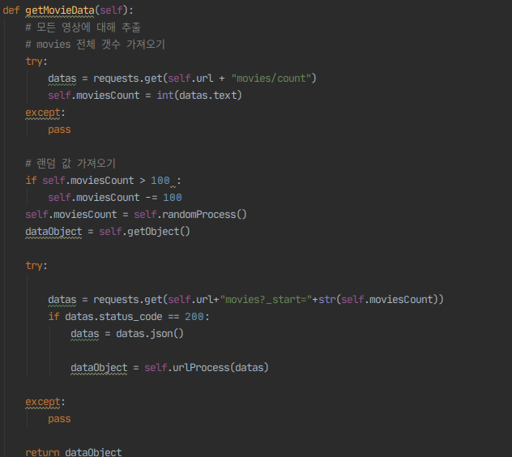
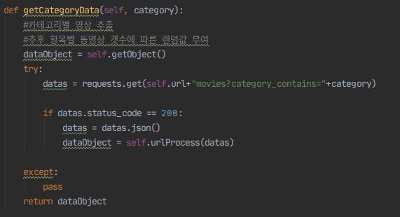
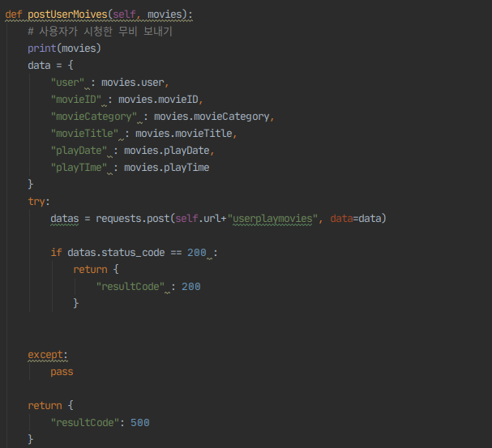
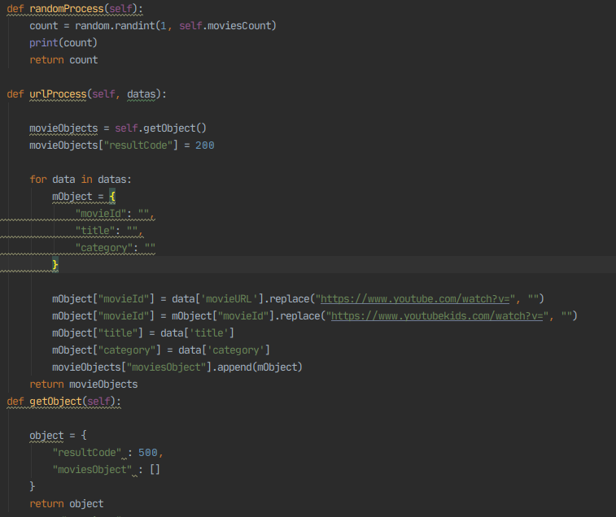

#### Python Server (중앙서버)
   fastAPI를 이용한 서버구성  
   https://github.com/sion9262/ukidfastapi
            
   #### 설치방법
         git clone https://github.com/sion9262/ukidfastapi.git
   #### 필요라이브러리 
         PYTHON VERSION >= 3.6

         pip install fastapi
        
         pip install email-validator
        
         pip install uvicorn
        
         실행 방법 : uvicorn main:app --reload
         
   #### 디렉토리 구조
   
        
   #### main.py
   
     
   API를 처리하는 부분입니다.  
   각 기능 Auth, Movies에 관한 Model을 생성하며 로직을 수행합니다.
        
   #### Auth/Auth.py
   Auth class 는 아래의 기능을 수행합니다.   
   로그인, 회원가입, 유저정보설정, 유저정보 받아오기와 같은 기능을 수행합니다.
   #####Login 
   
        
   #####Register
   
        
   ##### setUser
   
        
   ##### userplaymovies
   
        
   #### Moives/Moives.py
   Movies class 는 아래의 기능을 수행합니다.   
   전체 동영상 가져오기, 카테고리별 동영상 가져오기,   
   유저가 시청한 동영상 저장, 랜덤 영상 프로세싱 기능을 수행합니다.
   #####getMovies 
   
        
   #####getcategory
   
        
   ##### userplaymovies
   
        
   ##### movieUtil
   